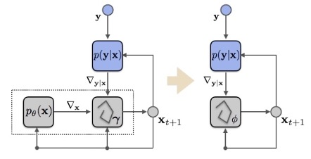
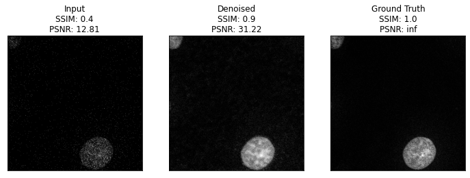

# Deep-Learning-Denoising

The focus of this project is using deep learning to denoise cellular images. 

A modification of the [Recurrent Inference Machine (RIM)](https://www.sciencedirect.com/science/article/abs/pii/S1361841518306078) architecture is the main technique employed. 

 

Herein, we use the log likelihood of the Poisson distribution in order to successfully denoise cell images which are dominated by signal-dependent noise rather than additive gaussian white noise.

Much credit to Patrick Putzky for uploading some base code.
